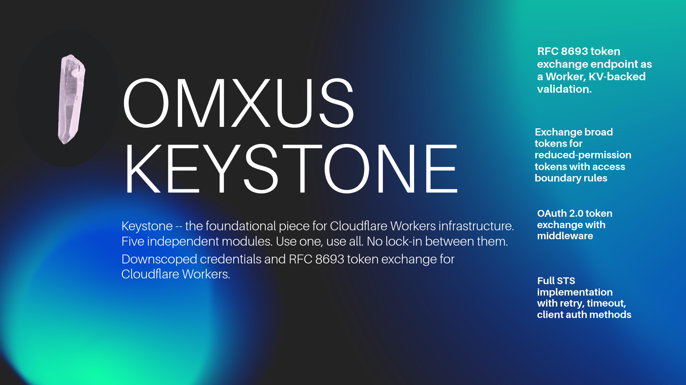

<p align="center">
  
</p>

---

## Inspired by

- **Google Cloud auth patterns** -- credential access boundaries, STS token exchange (RFC 8693), downscoped credentials
- **OpenTelemetry** -- W3C Trace Context propagation, baggage headers, span context management
- **Firebase infrastructure** -- user import/export pipelines, environment configuration management, bulk data operations
- **mTLS device attestation** -- certificate provisioning, hardware key interfaces (WebAuthn/FIDO2), TLS-in-TLS tunneling

All adapted for the Cloudflare Workers runtime: no Node.js dependencies, Web Crypto API throughout, native bindings for D1/R2/KV.

---

## Modules

### `src/auth/` -- Scoped Tokens

Downscoped credentials and RFC 8693 token exchange for Cloudflare Workers.

| File | What it does |
|------|-------------|
| `scoped-tokens.ts` | `ScopedTokenClient` -- exchange broad tokens for reduced-permission tokens with access boundary rules |
| `scoped-tokens.types.ts` | `DownscopedTokenClient` -- RFC 8693 token exchange endpoint as a Worker, KV-backed validation |
| `token-exchange.ts` | `TokenExchangeClient` -- OAuth 2.0 token exchange with middleware (`withTokenExchange`) |
| `token-exchange.types.ts` | `StsCredentials` -- full STS implementation with retry, timeout, client auth methods |

```ts
import { DownscopedTokenClient } from './src/auth/scoped-tokens.types';

const client = new DownscopedTokenClient(sourceToken, {
  accessBoundary: {
    accessBoundaryRules: [{
      resourceType: 'zone',
      resourceId: 'abc123',
      permissions: ['read']
    }]
  }
});

const scoped = await client.exchangeToken(env);
// scoped.access_token -- reduced-permission token
```

### `src/mtls/` -- Mutual TLS & Device Trust

Certificate provisioning, hardware key registration, and TLS tunneling.

| File | What it does |
|------|-------------|
| `cert-provider.ts` | `getClientSSLCredentials` -- retrieve client certificates from KV, R2, or mTLS bindings |
| `hardware-key.ts` | `HardwareKeyInterface` -- WebAuthn registration/authentication with D1 storage |
| `signers.ts` | `CloudflareMTLSSigner` -- validate client certificates, manage trusted signers |
| `tls-config.ts` | `TLSConfig` -- certificate parsing, validation, hostname matching, DER/PEM conversion |
| `tunnel.ts` | `SSLTransport` / `HTTPTunnel` -- TLS-in-TLS tunneling over WebSocket |

```ts
import { CloudflareMTLSSigner, withMTLSValidation } from './src/mtls/signers';

// As middleware
export default {
  fetch: withMTLSValidation(async (request, env, ctx) => {
    // request is guaranteed to have a valid client certificate
    return new Response('Authenticated');
  })
};
```

### `src/trace/` -- Observability

W3C Trace Context and Baggage propagation for distributed tracing across Workers.

| File | What it does |
|------|-------------|
| `w3c-propagator.ts` | `W3CTraceContextPropagator` -- inject/extract `traceparent` and `tracestate` headers |
| `baggage-propagator.ts` | `W3CBaggagePropagator` -- propagate key-value baggage across service boundaries |
| `tracestate-impl.ts` | `TraceStateImpl` -- immutable tracestate management per W3C spec |
| `AnyValue.ts` | Dynamic value types for span attributes, with Analytics Engine converters |
| `Attributes.ts` | Attribute validation, sanitization, storage to KV/R2/D1 |

```ts
import { extractTraceFromRequest, injectTraceIntoResponse, createSpanContext } from './src/trace/w3c-propagator';

export default {
  async fetch(request, env) {
    const traceCtx = extractTraceFromRequest(request);
    // ...do work...
    return injectTraceIntoResponse(new Response('ok'), traceCtx);
  }
};
```

### `src/genai/` -- AI Routing

Multi-provider LLM client with function calling, embeddings, image/video generation, and caching.

| File | What it does |
|------|-------------|
| `index.ts` | `CloudflareAIPlugin` -- plugin system with model/embedder references, provider routing |
| `client.ts` | `LLMClient` -- multi-provider HTTP client (OpenAI, Anthropic, DeepSeek) with streaming |
| `gemini.ts` | `CloudflareLLMClient` -- provider adapters with function calling and tool conversion |
| `embedder.ts` | `CloudflareEmbedder` -- embedding generation with KV caching and R2 persistence |
| `imagen.ts` | `ImageGenerationServiceRegistry` -- image generation via Stability AI, DALL-E, with R2 storage and queue support |
| `veo.ts` | Video generation with D1-backed long-running operations |
| `types.ts` | Full type system: `GenerateContentRequest`, `Tool`, `FunctionDeclaration`, safety settings |
| `utils.ts` | API key management from env/KV/D1 with fallback chain |

```ts
import { CloudflareAIPlugin } from './src/genai/index';

const plugin = new CloudflareAIPlugin({ defaultProvider: 'anthropic' });
plugin.initialize(env);

const model = plugin.model('anthropic:claude-3-5-sonnet-20241022');
const response = await model.invoke({
  model: 'claude-3-5-sonnet-20241022',
  messages: [{ role: 'user', content: 'Hello' }],
}, env);
```

### `src/migration/` -- User Import/Export

Bulk user operations for D1 with Firebase-compatible formats.

| File | What it does |
|------|-------------|
| `user-export.ts` | `serialExportUsers` -- paginated export to R2 in CSV or JSON, with Firebase-compatible field mapping |
| `user-import.ts` | `importUsers` -- validate and import users to D1, supports 10 hash algorithms, provider linking |
| `env-config.ts` | `materializeAll` -- hierarchical config management in D1+KV with dot-notation keys |
| `http-client.ts` | `Client` -- authenticated HTTP client with retry, timeout, streaming, exponential backoff |

```ts
import { importUsers, validateOptions } from './src/migration/user-import';

const hashOptions = validateOptions({ hashAlgo: 'BCRYPT' });
const result = await importUsers(env, users, hashOptions);
// result.importedCount, result.errors
```

---

## Composition Examples

### Tokens + mTLS: Secure service-to-service calls

```ts
import { DownscopedTokenClient } from './src/auth/scoped-tokens.types';
import { withMTLSValidation } from './src/mtls/signers';

// Service A: issue scoped tokens after mTLS validation
export default {
  fetch: withMTLSValidation(async (request, env) => {
    const client = new DownscopedTokenClient(env.MASTER_TOKEN, {
      accessBoundary: {
        accessBoundaryRules: [{
          resourceType: 'kv',
          resourceId: 'user-data',
          permissions: ['read'],
        }]
      }
    });
    const token = await client.exchangeToken(env);
    return Response.json({ token: token.access_token });
  })
};
```

### Observability + GenAI: Traced AI pipelines

```ts
import { extractTraceFromRequest, createTraceHeaders } from './src/trace/w3c-propagator';
import { CloudflareAIPlugin } from './src/genai/index';

export default {
  async fetch(request, env) {
    const trace = extractTraceFromRequest(request);
    const traceHeaders = createTraceHeaders(trace);

    const plugin = new CloudflareAIPlugin();
    plugin.initialize(env);

    const model = plugin.model('openai:gpt-4o');
    const result = await model.invoke({
      model: 'gpt-4o',
      messages: [{ role: 'user', content: 'Summarize this' }],
    }, env);

    // Forward trace context to downstream services
    await fetch('https://downstream.example.com/notify', {
      headers: traceHeaders,
      method: 'POST',
      body: JSON.stringify(result),
    });

    return Response.json(result);
  }
};
```

---

## Quick Start

```bash
# Install dependencies
npm install

# Type check
npm run check

# Development
npm run dev

# Deploy
npm run deploy
```

Each module is independent. Import only what you use -- there are no cross-module dependencies.

---

## Deployment

See [docs/DEPLOYMENT.md](docs/DEPLOYMENT.md) for wrangler configuration, binding setup, and secret management.

## Architecture

See [docs/ARCHITECTURE.md](docs/ARCHITECTURE.md) for how modules relate and design decisions.

## Module Reference

See [docs/MODULES.md](docs/MODULES.md) for detailed per-module documentation.

---

## License

MIT -- see [LICENSE](LICENSE).
